# 2.1. Names and ages of all sailors
```
```
```
SELECT sname, age
FROM Sailors;
```
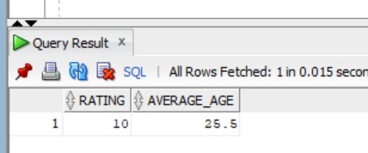
```
# 2. Sailors with rating above 7
```
```
SELECT *
FROM Sailors
WHERE rating > 7;
```

```
# 3. Names of sailors who reserved boat 103
```
```
SELECT DISTINCT s.sname
FROM Sailors s
JOIN Reserves r ON s.sid = r.sid
WHERE r.bid = 103;
```

```
# 4. SIDs of sailors who reserved a red boat
```
```

SELECT DISTINCT r.sid
FROM Reserves r
JOIN Boats b ON r.bid = b.bid
WHERE b.color = 'red';
```
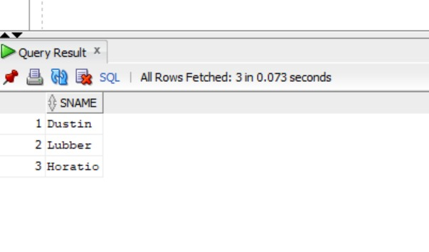
```
# 5. Names of sailors who reserved a red boat
```
```
SELECT DISTINCT s.sname
FROM Sailors s
JOIN Reserves r ON s.sid = r.sid
JOIN Boats b ON r.bid = b.bid
WHERE b.color = 'red';
```

```
# 6. Colors of boats reserved by Lubber
```
```
SELECT DISTINCT b.color
FROM Sailors s
JOIN Reserves r ON s.sid = r.sid
JOIN Boats b ON r.bid = b.bid
WHERE s.sname = 'Lubber';
```
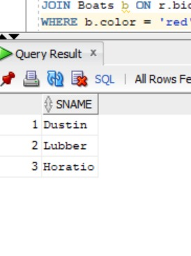
```
# 7. Names of sailors who reserved at least one boat
```
```
SELECT DISTINCT s.sname
FROM Sailors s
JOIN Reserves r ON s.sid = r.sid;
```

```
# 8. Ratings of persons who sailed two different boats on the same day
```
```
SELECT DISTINCT s.sname, s.rating
FROM Sailors s
JOIN Reserves r1 ON s.sid = r1.sid
JOIN Reserves r2 ON r1.sid = r2.sid
                  AND r1.day = r2.day
                  AND r1.bid <> r2.bid;
```
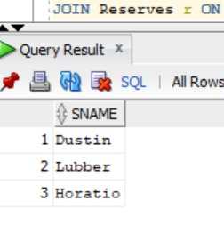
```
# 9. Ages of sailors whose name begins and ends with B and has at least 3 characters
```
```
SELECT age
FROM Sailors
WHERE sname LIKE 'B%B'
AND LENGTH(sname) >= 3;
```

```
# 10. Names of sailors who reserved a red boat OR a green boat
```
```
SELECT DISTINCT s.sname
FROM Sailors s
JOIN Reserves r ON s.sid = r.sid
JOIN Boats b ON r.bid = b.bid
WHERE b.color IN ('red', 'green');
```

```
# 11. Names of sailors who reserved both red and green boats
```
```
SELECT DISTINCT s.sname
FROM Sailors s
WHERE s.sid IN (
    SELECT r.sid
    FROM Reserves r
    JOIN Boats b ON r.bid = b.bid
    WHERE b.color = 'red'
)
AND s.sid IN (
    SELECT r.sid
    FROM Reserves r
    JOIN Boats b ON r.bid = b.bid
    WHERE b.color = 'green'
);
```

```
# 12. SIDs of sailors who reserved red boats but NOT green boats
```
```
SELECT DISTINCT s.sid
FROM Sailors s
JOIN Reserves r ON s.sid = r.sid
JOIN Boats b ON r.bid = b.bid
WHERE b.color = 'red'
AND s.sid NOT IN (
    SELECT r2.sid
    FROM Reserves r2
    JOIN Boats b2 ON r2.bid = b2.bid
    WHERE b2.color = 'green'
);
```
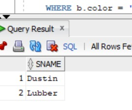
```
# 13. Ratings of sailors with rating 10 OR who reserved boat 104
```
```
SELECT DISTINCT s.rating
FROM Sailors s
LEFT JOIN Reserves r ON s.sid = r.sid
WHERE s.rating = 10
   OR r.bid = 104;
```

```
# 14. Names of sailors who reserved boat 103
```
```
SELECT DISTINCT s.sname
FROM Sailors s
JOIN Reserves r ON s.sid = r.sid
WHERE r.bid = 103;
```
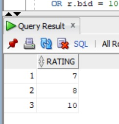
```
# 15. Names of sailors who reserved a red boat
```
```
SELECT DISTINCT s.sname
FROM Sailors s
JOIN Reserves r ON s.sid = r.sid
JOIN Boats b ON r.bid = b.bid
WHERE b.color = 'red';
```
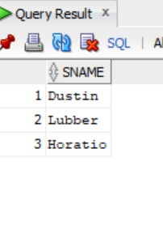
```
# 16. Names of sailors who reserved boat 103
```
```
SELECT DISTINCT s.sname
FROM Sailors s
JOIN Reserves r ON s.sid = r.sid
WHERE r.bid = 103;
```
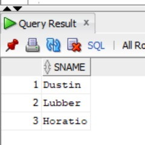
```
# 17. Sailors whose rating is better than SOME sailor named Horatio
```
```
SELECT *
FROM Sailors
WHERE rating > ANY (
    SELECT rating
    FROM Sailors
    WHERE sname = 'Horatio'
);
```
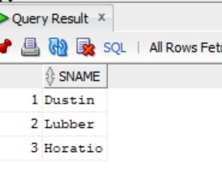
```
# 18. Sailors whose rating is better than EVERY sailor named Horatio
```
```
SELECT *
FROM Sailors
WHERE rating > ALL (
    SELECT rating
    FROM Sailors
    WHERE sname = 'Horatio'
);
```
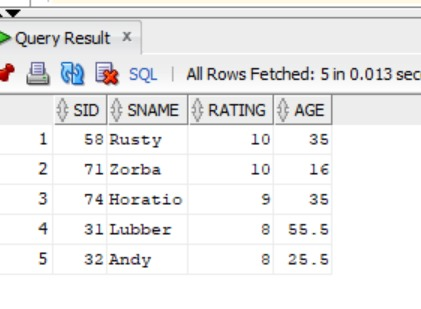
```
# 19. Sailors with the highest rating
```
```
SELECT *
FROM Sailors
WHERE rating = (
    SELECT MAX(rating)
    FROM Sailors
);
```
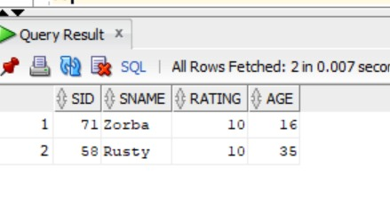
```
# 20. Names of sailors who reserved both red and green boats
```
```
SELECT DISTINCT s.sname
FROM Sailors s
WHERE s.sid IN (
    SELECT r.sid
    FROM Reserves r
    JOIN Boats b ON r.bid = b.bid
    WHERE b.color = 'red'
)
AND s.sid IN (
    SELECT r.sid
    FROM Reserves r
    JOIN Boats b ON r.bid = b.bid
    WHERE b.color = 'green'
);
```
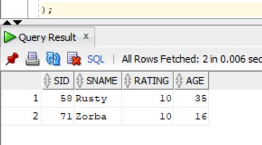
```
# 21. Names of sailors who reserved ALL boats
```
```
SELECT s.sname
FROM Sailors s
WHERE NOT EXISTS (
    SELECT b.bid
    FROM Boats b
    WHERE NOT EXISTS (
        SELECT r.bid
        FROM Reserves r
        WHERE r.sid = s.sid
        AND r.bid = b.bid
    )
);
```
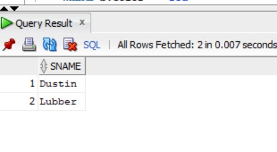
```
# 22. Average age of all sailors
```
```
SELECT AVG(age) AS average_age
FROM Sailors;
```
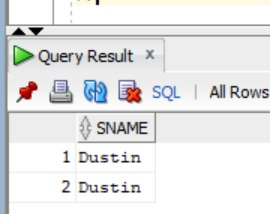
```
# 23. Average age of sailors with rating 10
```
```
SELECT AVG(age) AS average_age
SELECT sname, age
    FROM Sailors
```
```
```
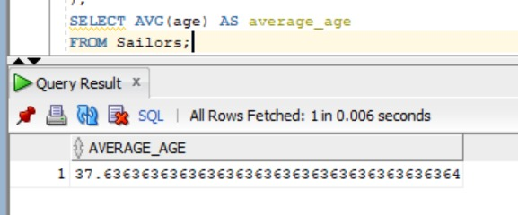
# 26. Number of different sailor names
```
```
SELECT COUNT(DISTINCT sname) AS different_names
FROM Sailors;
```
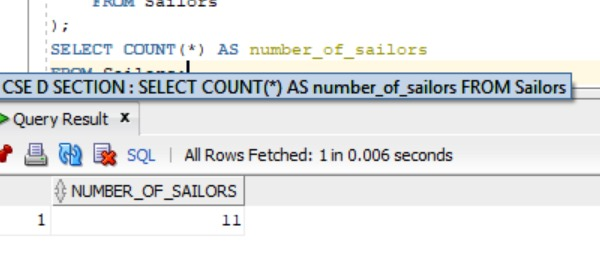
```
# 22. Average age of all sailors
```
```

SELECT AVG(age) AS average_age
FROM Sailors;
```

```
# 23. Average age of sailors with rating 10
```
```
SELECT AVG(age) AS average_age
FROM Sailors
WHERE rating = 10;
```

```
# 24. Name and age of the oldest sailor
```
```
SELECT sname, age
FROM Sailors
WHERE age = (
    SELECT MAX(age)
    FROM Sailors
);
```
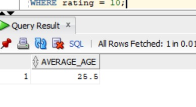
```
# 25. Number of sailors
```
```
SELECT COUNT(*) AS number_of_sailors
FROM Sailors;
```
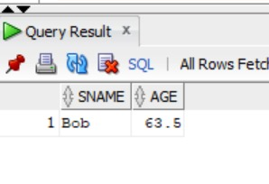
```
# 26. Number of different sailor names
```
```
SELECT COUNT(DISTINCT sname) AS different_names
FROM Sailors;
```

```
# 27. Sailors older than the oldest sailor with rating 10
```
```
SELECT sname, age
FROM Sailors
WHERE age > (
    SELECT MAX(age)
    FROM Sailors
    WHERE rating = 10
);
```
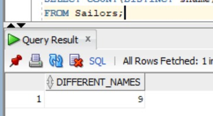
```
# 28. Youngest sailor for each rating level
```
```
SELECT rating, MIN(age) AS youngest_age
FROM Sailors
GROUP BY rating;
```
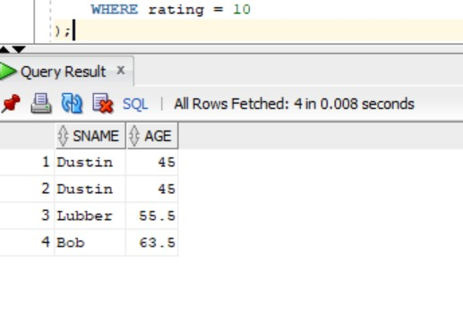
```
# 29. Youngest voting-age sailor for each rating having at least 2 voting-age sailors
```
```
SELECT rating, MIN(age) AS youngest_age
FROM Sailors
WHERE age >= 18
GROUP BY rating
HAVING COUNT(*) >= 2;
```
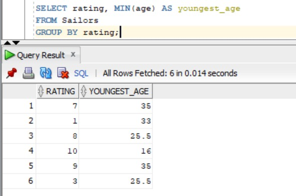
```
# 30. Number of reservations for each red boat
```
```
SELECT b.bid, COUNT(r.sid) AS number_of_reservations
FROM Boats b
LEFT JOIN Reserves r ON b.bid = r.bid
WHERE b.color = 'red'
GROUP BY b.bid;
```
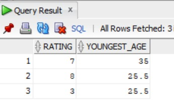
```
# 31. Average age for each rating having at least 2 sailors
```
```
SELECT rating, AVG(age) AS average_age
FROM Sailors
GROUP BY rating
HAVING COUNT(*) >= 2;
```
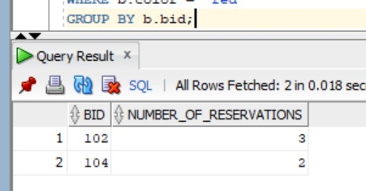
```
# 32. Average age of voting-age sailors for each rating having at least 2 voting-age sailors
```
```
SELECT rating, AVG(age) AS average_age
FROM Sailors
WHERE age >= 18
GROUP BY rating
HAVING COUNT(*) >= 2;
```
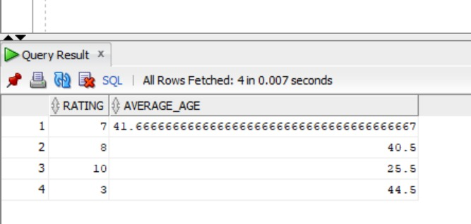
```
# 33. Average age of voting-age sailors for each rating having at least 2 such sailors
```
```
SELECT rating, AVG(age) AS average_age
FROM Sailors
WHERE age >= 18
GROUP BY rating
HAVING COUNT(*) >= 2;
```
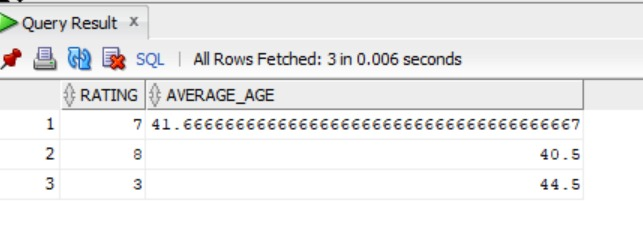
```
# 34. Rating(s) having the minimum average age
```
```
SELECT rating, AVG(age) AS average_age
FROM Sailors
GROUP BY rating
HAVING AVG(age) = (
    SELECT MIN(average_age)
    FROM (
        SELECT AVG(age) AS average_age
        FROM Sailors
        GROUP BY rating
    )
);
```
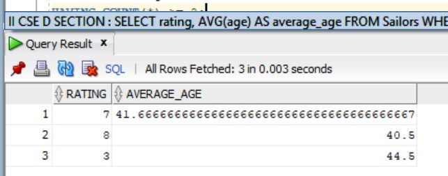
``````
FROM Sailors;
SELECT COUNT(*) AS number_of_sailors
```
# 25. Number of sailors
```

);
FROM Sailors
    SELECT MAX(age)
WHERE age = (
FROM Sailors


# 26. Number of different sailor names


SELECT COUNT(DISTINCT sname) AS different_names
FROM Sailors;


# 27. Sailors older than the oldest sailor with rating 10


SELECT sname, age
FROM Sailors
WHERE age > (
    SELECT MAX(age)
    FROM Sailors
    WHERE rating = 10
);


# 28. Youngest sailor for each rating level


SELECT rating, MIN(age) AS youngest_age
FROM Sailors
GROUP BY rating;


# 29. Youngest voting-age sailor for each rating having at least 2 voting-age sailors


SELECT rating, MIN(age) AS youngest_age
FROM Sailors
WHERE age >= 18
GROUP BY rating
HAVING COUNT(*) >= 2;


# 30. Number of reservations for each red boat


SELECT b.bid, COUNT(r.sid) AS number_of_reservations
FROM Boats b
LEFT JOIN Reserves r ON b.bid = r.bid
WHERE b.color = 'red'
GROUP BY b.bid;


# 31. Average age for each rating having at least 2 sailors


SELECT rating, AVG(age) AS average_age
FROM Sailors
GROUP BY rating
HAVING COUNT(*) >= 2;


# 32. Average age of voting-age sailors for each rating having at least 2 voting-age sailors


SELECT rating, AVG(age) AS average_age
FROM Sailors
WHERE age >= 18
GROUP BY rating
HAVING COUNT(*) >= 2;


# 33. Average age of voting-age sailors for each rating having at least 2 such sailors


SELECT rating, AVG(age) AS average_age
FROM Sailors
WHERE age >= 18
GROUP BY rating
HAVING COUNT(*) >= 2;


# 34. Rating(s) having the minimum average age


SELECT rating, AVG(age) AS average_age
FROM Sailors
GROUP BY rating
HAVING AVG(age) = (
    SELECT MIN(average_age)
    FROM (
        SELECT AVG(age) AS average_age
        FROM Sailors
        GROUP BY rating
    )
);


```
