# 3a Q1. Display Employee ID, First Name and Hire Date in DD-MON-YYYY format
```
```
```
SELECT employee_id, first_name, TO_CHAR(hire_date, 'DD-MON-YYYY')
FROM employee;
```
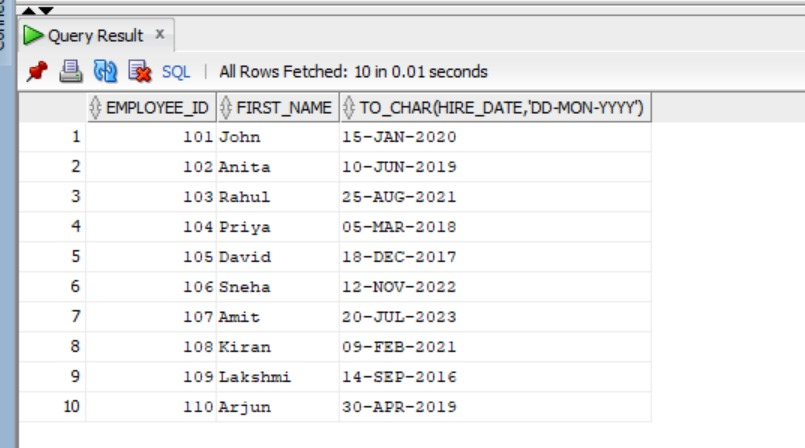
```
# Q2. Display Employee ID, First Name and Salary with currency symbol
```
```
SELECT employee_id, first_name, TO_CHAR(salary, 'L999,999.00')
FROM employee;
```
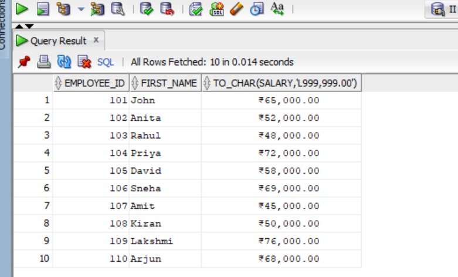
```
# Q3. Add 5000 to each employee's salary using TO_NUMBER
```
```
SELECT employee_id, first_name, TO_NUMBER(TO_CHAR(salary)) + 5000 AS new_salary
FROM employee;
```
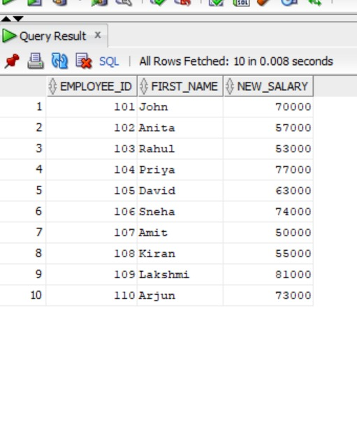
```
# Q4. Display employees hired after 01-JAN-2020
```
```
SELECT *
FROM employee
WHERE hire_date > TO_DATE('01-JAN-2020', 'DD-MON-YYYY');
```
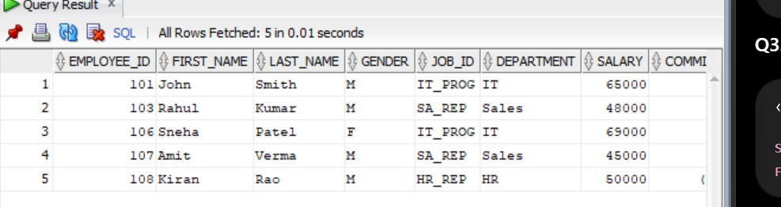
```
# Q5. Concatenate first name and last name using ||
```
```
SELECT first_name || ' ' || last_name AS full_name
FROM employee;
```
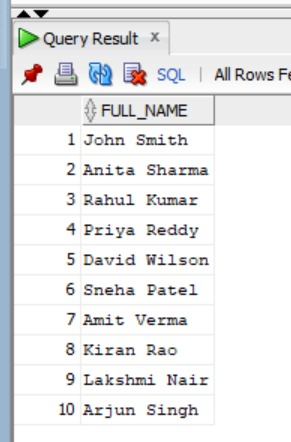
```
# Q6. Concatenate first name and last name using CONCAT
```
```
SELECT CONCAT(CONCAT(first_name, ' '), last_name) AS full_name
FROM employee;
```
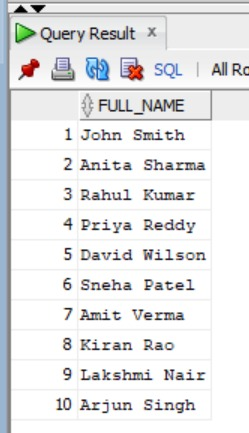
```
# Q7. Left-pad first name with *
```
```
SELECT LPAD(first_name, 10, '*')
FROM employee;
```
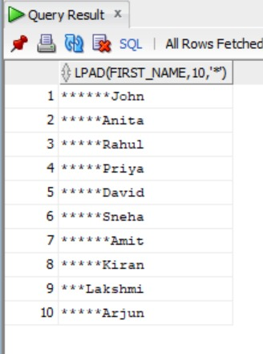
```
# Q8. Right-pad first name with *
```
```
SELECT RPAD(first_name, 10, '*')
FROM employee;
```
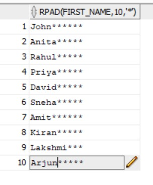
```
# Q9. Remove leading spaces using LTRIM
```
```
SELECT LTRIM(first_name)
FROM employee;
```
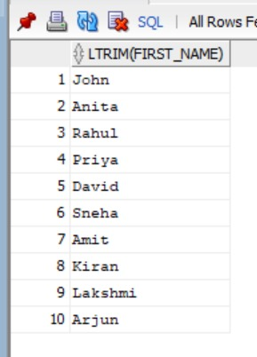
```
# Q10. Remove trailing spaces using RTRIM
```
```
SELECT RTRIM(first_name)
FROM employee;
```
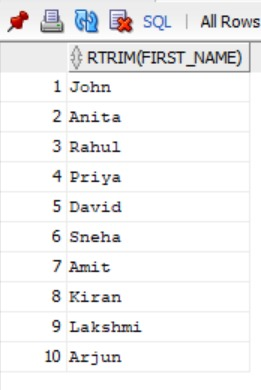
```
# Q11. Display first names in lowercase
```
```
SELECT LOWER(first_name)
FROM employee;
```
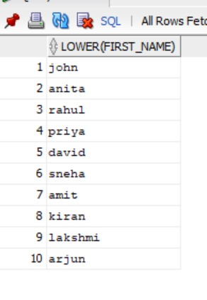
```
# Q12. Display first names in uppercase
```
```
SELECT UPPER(first_name)
FROM employee;
```
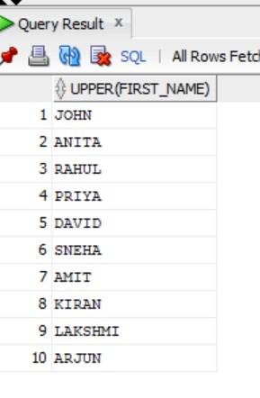
```
# Q13. Display first names in proper case
```
```
SELECT INITCAP(first_name)
FROM employee;
```
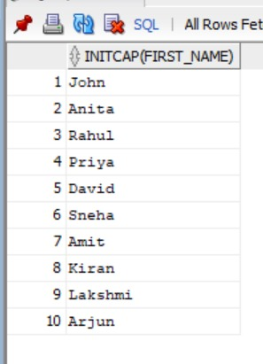
```
# Q14. Display length of each first name
```
```
SELECT first_name, LENGTH(first_name) AS name_length
FROM employee;
```
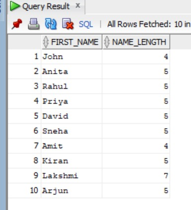
```
# Q15. Display first three characters of each first name
```
```
SELECT first_name, SUBSTR(first_name, 1, 3) AS first_three
FROM employee;
```

```
# Q16. Find position of character a in each first name
```
```
SELECT first_name, INSTR(LOWER(first_name), 'a') AS position
FROM employee;
```
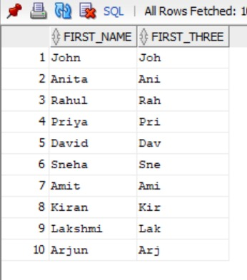
```
# Q17. Display current system date with employee details
```
```
SELECT employee_id, first_name, last_name, SYSDATE
FROM employee;
```
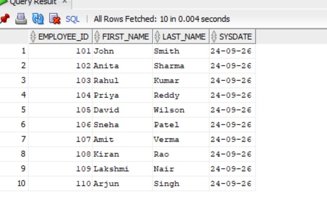
```
# Q18. Display next Monday after each employee's hire date
```
```
SELECT first_name, hire_date,
       NEXT_DAY(hire_date, 'MONDAY') AS next_monday
FROM employee;
```
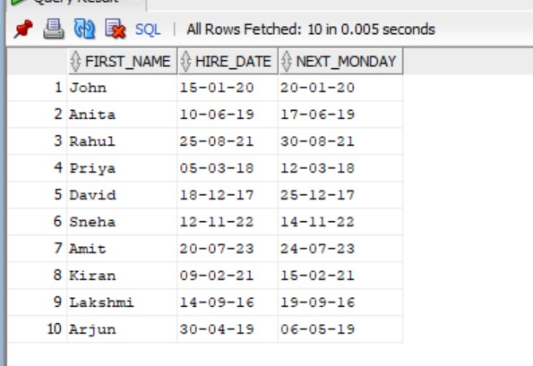
```
# Q19. Add six months to each employee's hire date
```
```
SELECT first_name, hire_date,
       ADD_MONTHS(hire_date, 6) AS new_date
FROM employee;
```
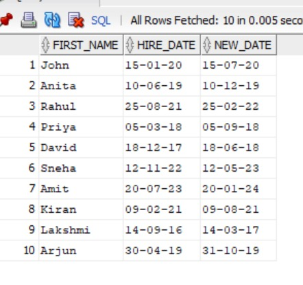
```
# Q20. Display last day of the month of each employee's hire date
```
```
SELECT first_name, hire_date,
       LAST_DAY(hire_date) AS last_day
FROM employee;
```
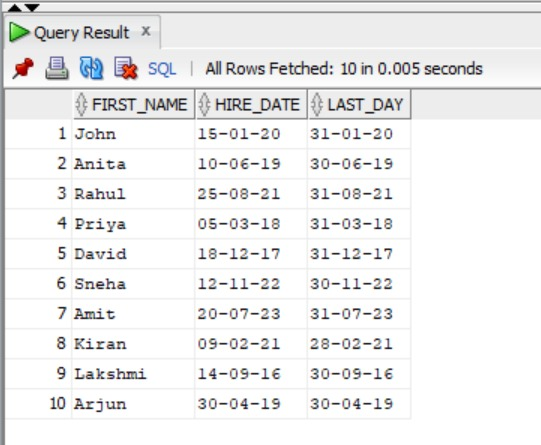
```
# Q21. Calculate total number of months each employee has worked
```
```
SELECT first_name,
       MONTHS_BETWEEN(SYSDATE, hire_date) AS months_worked
FROM employee;
```
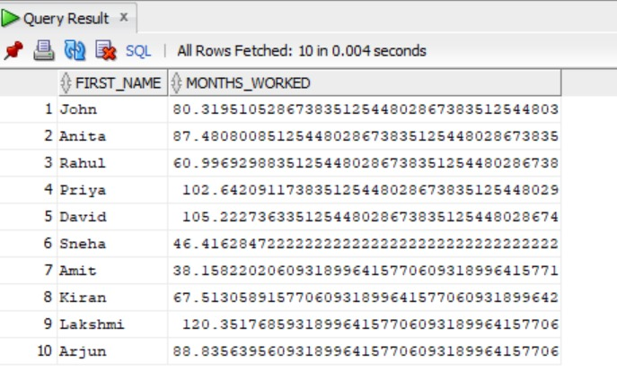
```
# Q22. Display smaller value between salary and 60000
```
```
SELECT first_name, LEAST(salary, 60000) AS smaller_value
FROM employee;
```
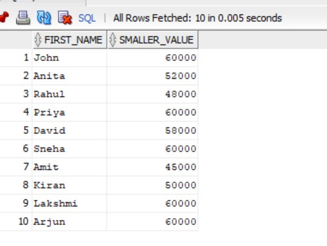
```
# Q23. Display greater value between salary and 60000
```
```
SELECT first_name, GREATEST(salary, 60000) AS greater_value
FROM employee;
```
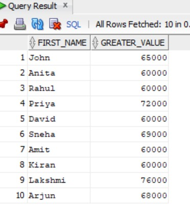
```
# Q24. Display first day of the month of hire date
```
```
SELECT first_name, hire_date,
       TRUNC(hire_date, 'MM') AS first_day
FROM employee;
```
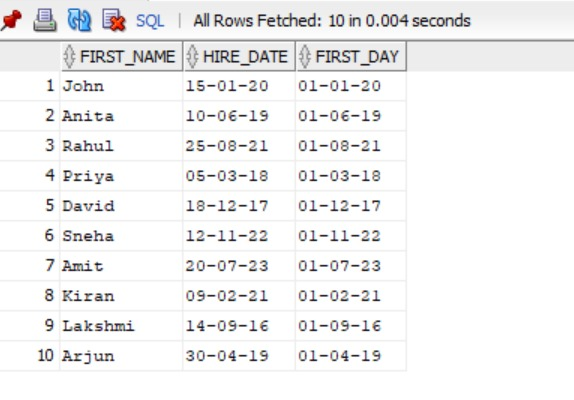
```
# Q25. Round each employee's hire date to nearest month
```
```
SELECT first_name, hire_date,
       ROUND(hire_date, 'MM') AS rounded_date
FROM employee;
```
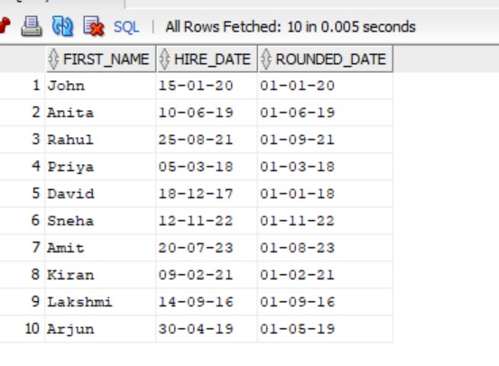
```
# Q26. Display hire date as DAY, DD-MON-YYYY
```
```
SELECT first_name,
       TO_CHAR(hire_date, 'DAY, DD-MON-YYYY') AS hire_date
FROM employee;
```
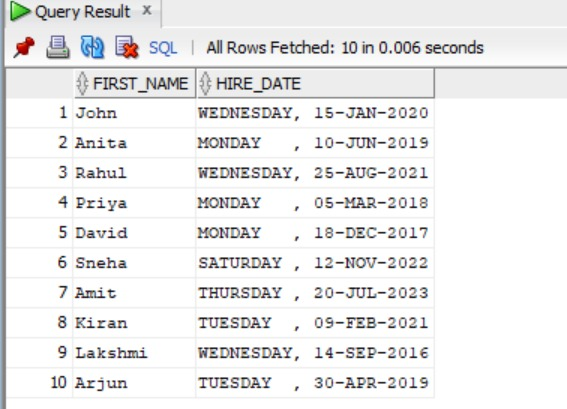
```
# Q27. Display employees hired before 01-JAN-2019
```
```
SELECT *
FROM employee
WHERE hire_date < TO_DATE('01-JAN-2019', 'DD-MON-YYYY');
```
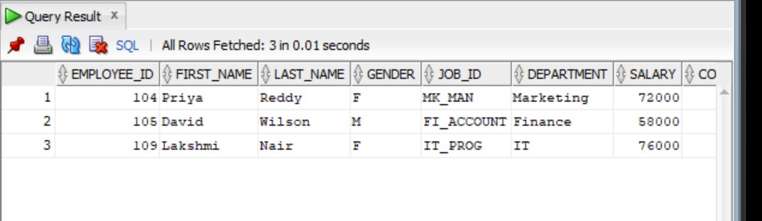
```
